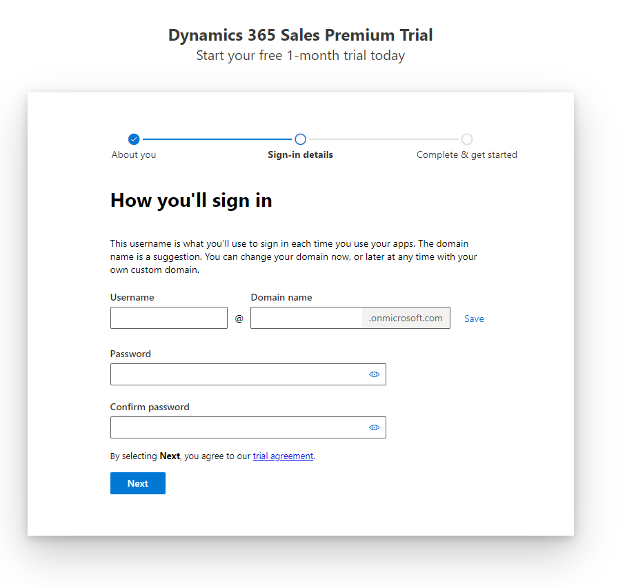

# How To Create A New Trial Environment

## 1- Go To Registration Page

- Choose the app on the page and click on "Try For Free"
  https://dynamics.microsoft.com/en-us/dynamics-365-free-trial/

 

## 2- Login/Register Account

- If you have an work account you can re-use or you can create a completely new account.
- To enable setting up new account, first click on "Start your free trial" button, it will bring up the "Click here" hyperlink.

- Enter your personal email address, even though you use the same email address for different trial environments it will threat as separate environments, so you can create as much environment as needed by using same email address.

- It is important to select correct "Country or Region". Some of the Apps may not be available in other countries, so leave it as "United States".

- Check conflict for username and domain name by clicking on Save button.

- Continue with "Get Started"

## 3- Environment Setup

- Keep the Region as "United States-Default".
- Keep the Type as "Trial (subscription-based)", other options do not allow apps to be installed.

- Select the app you want to install.
  

- Example for Norway, and notice the difference in the list of available Apps.

- After selecting app to install, continue with "Save" button, environment creation will take time, eventually you will see newly created environment.

