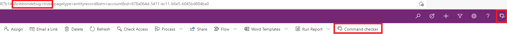
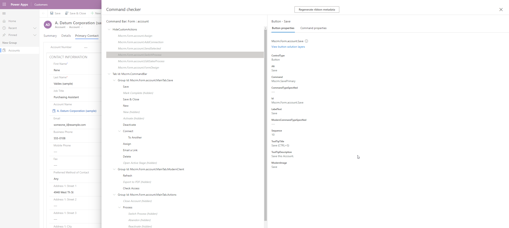
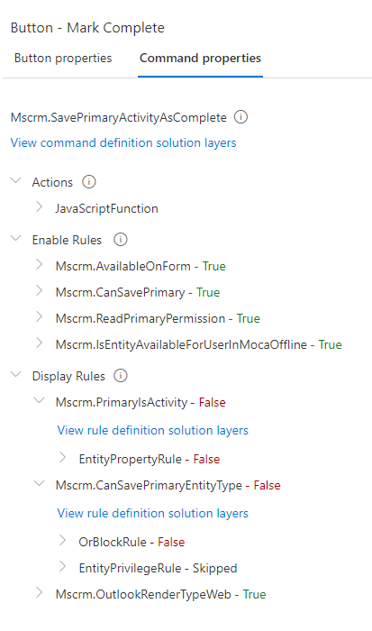
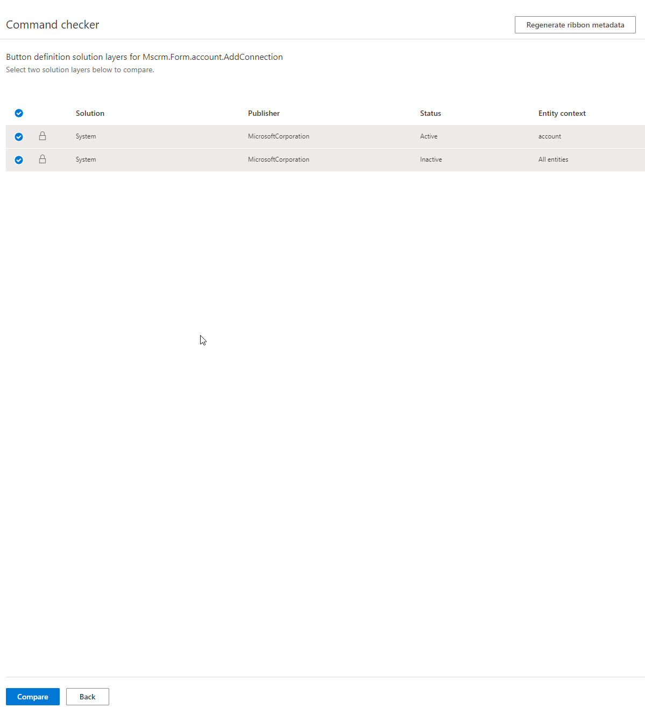

# How to Use Command Checker

# 1- How To Enable

It is an in-app tool and can be enabled by adding `&ribbondebug=true` to url.
After enabling, it is accessible as 2 ways as shown below.
 
 

 
 

# 2- How Does It Work

Once clicked on Command Checker, in Command Properties tab it provides all ribbon related information along with rule validation results.

Command Properties

# 3- Solution Layers

If there are multiple managed solutions containing same ribbon definition, then you can compare the differences in-app, and see which solution changes which part.

# 4- Regenerating Ribbon Metadata

Due to some unknown reason, if a button is visible which should not be or not visible which should be, then system wide ribbon buttons can be re-evaluated and metadata can be regenerated. Below message will pop-up

    Do you want to regenerate all ribbon client metadata for this environment? This background operation may take 15 minutes or longer and may delay other background operations while in-progress. The status can be viewed within Solution history. Once completed clear your browser cache and reopen the application.

# References

- https://docs.microsoft.com/en-GB/troubleshoot/power-platform/power-apps/ribbon-issues
- https://docs.microsoft.com/en-us/troubleshoot/power-platform/power-apps/regenerate-ribbon-metadata
- https://powerapps.microsoft.com/en-us/blog/introducing-command-checker-for-model-app-ribbons/
