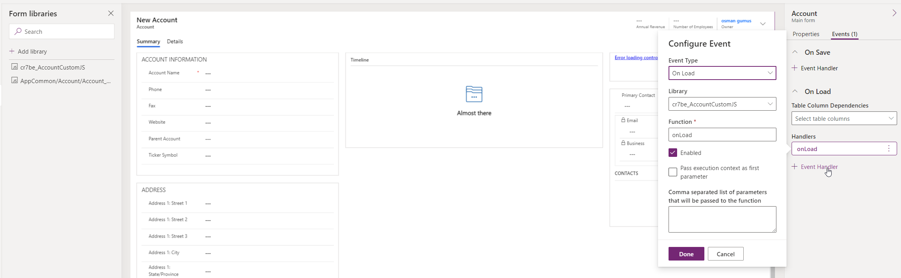

# How To Work With WebResources Locally with Fiddler

If you need to change a webresource and test it locally without needing to deploy to Dataverse then you need to use Fiddler with AutoResponder feature.

# Preparetion

## 1- Create WebResource

 

## 2- Deploy and Configure

 

## 3- Make Sure WebResource Is Lodaded And Open In A New Tab

 

## 4- Open In A New Tab And Refresh Page

 

## 5- Add Fiddler Rule

 

## 6- Compare Results

