# .Net Standard 2.0 Plugin Sample (Experimental)

Based on .Net Standard compatibility table below, it is possible to reference .Net Framework assemblies
Reference: https://dotnet.microsoft.com/en-us/platform/dotnet-standard#versions

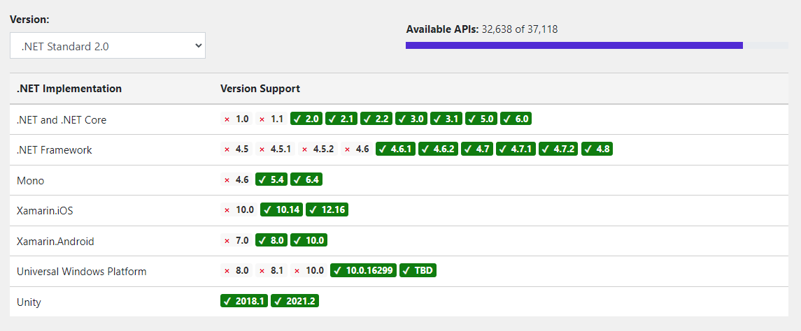

## Limitations

- If you register the assembly manually via Plugin Registration Tool it works, but with the new Package registration, it does not work.
  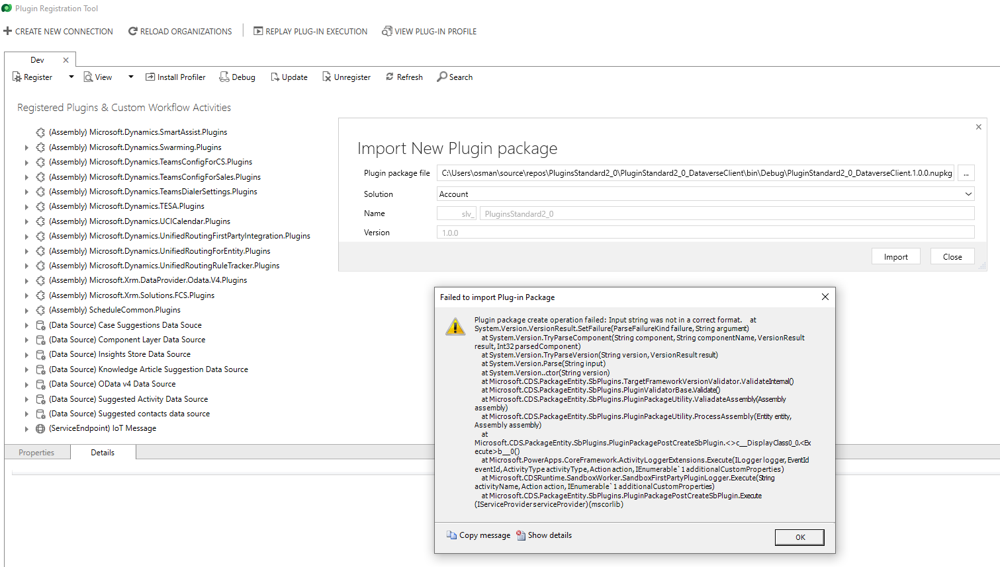

## Create New Project

Create a new class library (not .Net Framework).
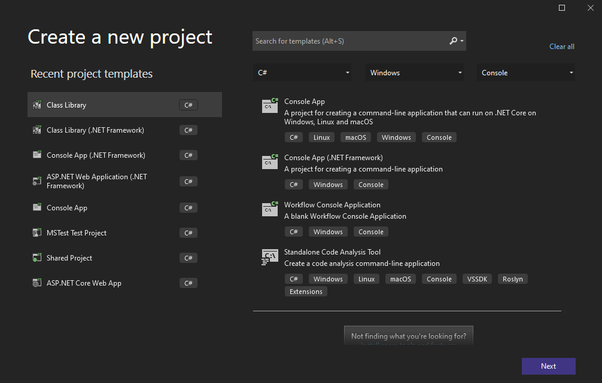

Name the project and select the location.
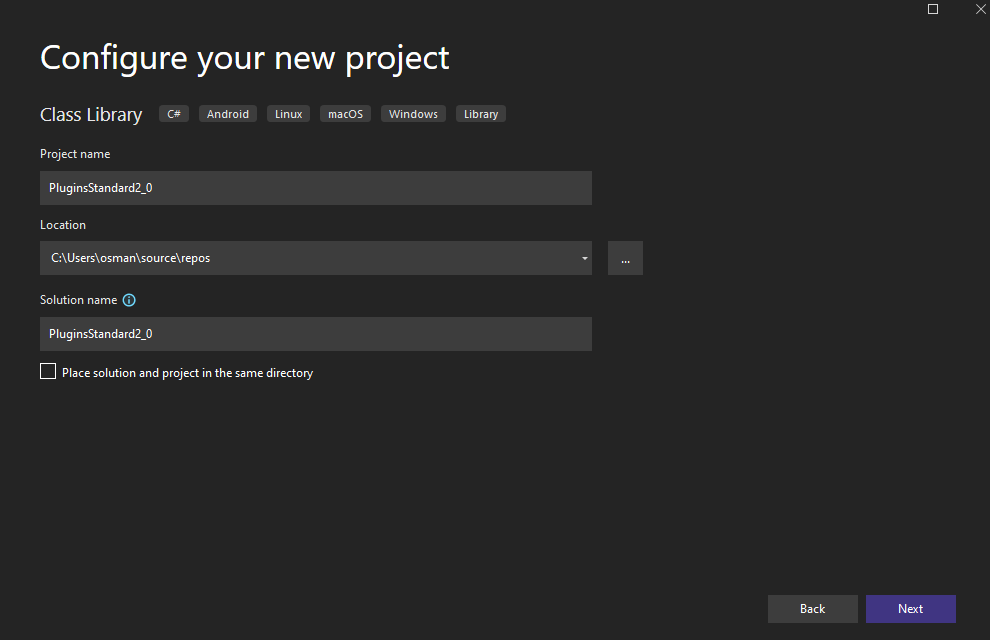

Select .Net Standard 2.0. Version above 2.0 does not support .Net Framework references.
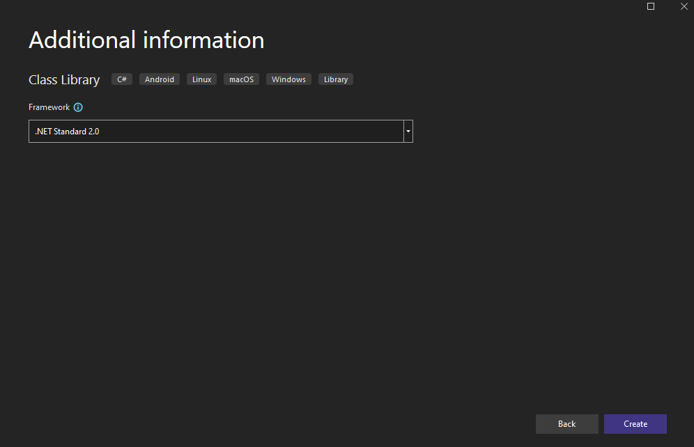

If you add "Microsoft.CrmSdk.CoreAssemblies" nuget package to project, it won't stop you but it will give warning, saying it is not fully compatible.
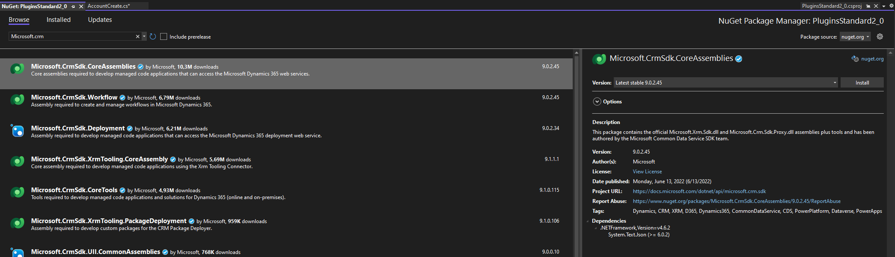
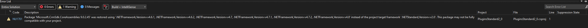

And it will register with no problems
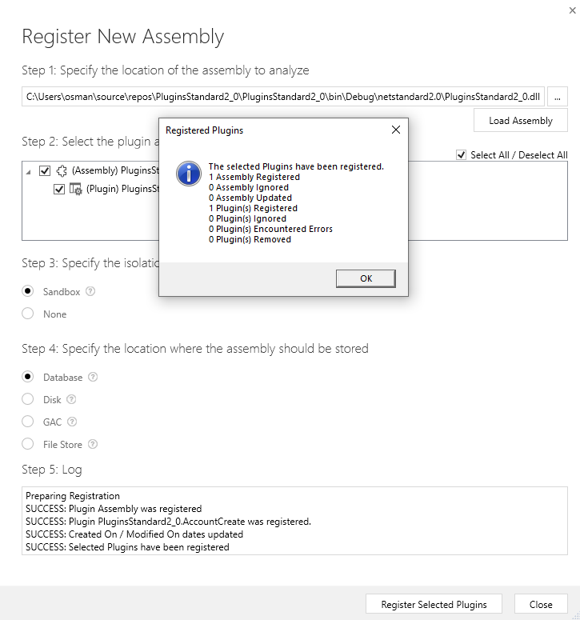
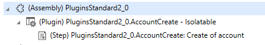

## Create New Project - Dataverse.Client

If you create a new .Net Standard 2.0 project with "Microsoft.PowerPlatform.Dataverse.Client" nuget package, you will still receive the same warning message.

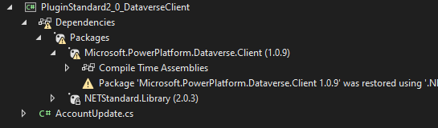
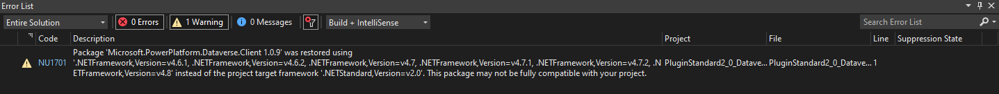

And will still let you register the plugin assembly.

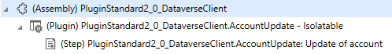

## Result

As it is already mentioned in Microsoft documentation, plugins will continue using .Net Framework 4.6.2 or above, there is no official support for .Net Standard.

## References

- https://dotnet.microsoft.com/en-us/platform/dotnet-standard
- https://docs.microsoft.com/en-us/power-apps/developer/data-platform/sdk-client-transition
