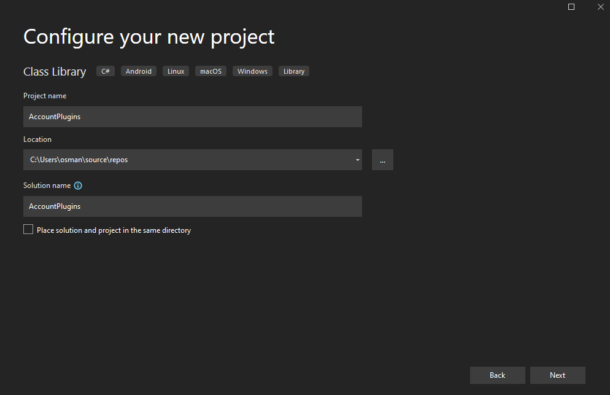

# Dependent Assembly Plug-ins

## Prerequisites

Download latest Plugin Registration Tool

- https://docs.microsoft.com/en-us/dynamics365/customerengagement/on-premises/developer/download-tools-nuget?view=op-9-1
- https://www.nuget.org/packages/Microsoft.CrmSdk.XrmTooling.PluginRegistrationTool

Navigate to Plugin Registration Tool folder (Tools\PluginRegistration) and verify `appsettings.json` contains `"PluginNupkg" : true`

Install PowerPlatform CLI => https://aka.ms/PowerAppsCLI

## Limitations

- A plugin package is limited to 16 MB in size or 50 assemblies.
- Workflow extensions, also known as workflow assemblies, workflow activities or custom workflow activities are not supported.
- On-premises environments are not supported.
- You cannot directly unregister an assembly if it is part of a package.

## Create Plugin Project

We are aiming to generate a nuget package that contains all dependencies to register, and it is much easier to generate it automatically with `SDK-Style` project. There are 2 ways of creating the project,

- `pac plugin init`
- Create .Net Standard project and change the TargetFramework to net462 `<TargetFramework>net462</TargetFramework>`

Below uses second approach.

Add below Nuget packages

- `Microsoft.CrmSdk.CoreAssemblies`
- `Microsoft.PowerApps.MSBuild.Plugin`
- `Microsoft.NETFramework.ReferenceAssemblies`

Change project type

## Create PluginBase Project

Create a new project same as previous and add project as dependency to first project.

Solution structure

## Nuget Package Generation

Change main projects Package setting to generate nuget packages at each build.

Open the generated nuget package and verify the content. Also notice that PluginBase assembly is also added to package.

If you try to register this package, you'll get an error.

You need to make sure `Microsoft.Xrm.Sdk.dll` is not in the package.
And make sure after removing, save the nuget file.

## Registering Plugin Package

Register the nuget package through Plugin Registration Tool

You can change the view to confirm package is registered.

## References

- https://docs.microsoft.com/en-us/power-apps/developer/data-platform/dependent-assembly-plugins
- https://www.microsoft.com/en-us/videoplayer/embed/RE52w4m
