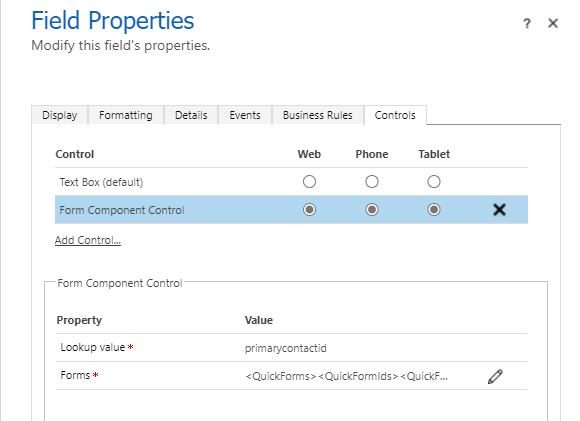
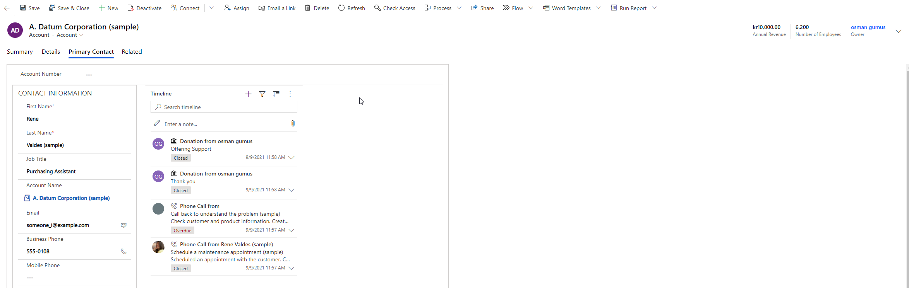
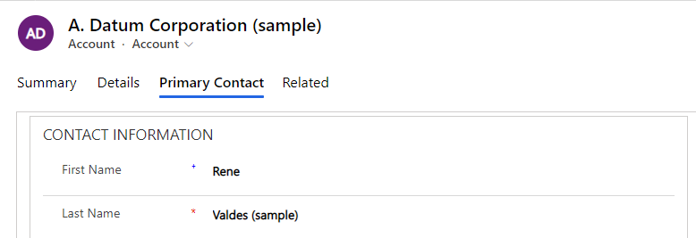

# Form Control Component Usage

A lookup can be visualized as it's Main Form as part of parent entity.
 
Eg: Primary Contact lookup on Account entity can be shown as Contact Main Form in Account Form.

## 1- How To

- Use Classic Form Designer
- Create a new Main form to be used as FFC
  - Form should contain only 1 tab, other tabs won't be shown
- Get the Id of form and prepare in below format

`<QuickForms><QuickFormIds><QuickFormId entityname="TableName">FormID</QuickFormId></QuickFormIds></QuickForms>`

- Go to Field Properties of lookup field which you want to shot as FFC
- Add Form Component Control and paste the above xml in Forms input parameter
- 

## 2- Possibilities

- Works with only Main Forms in Main Forms.
- BPF on referenced entity is not supported. (Even if it shows, may result unexpected results)
- If Form Control Component has another FCC, then it is not supported.
- Contact form control component, is editable and changes can be saved.
- Control can be placed in different sized tab/sections
- Tab/Section can have other controls as well (Eg: Account Number field from Account entity)
- 
- Both forms can be saved at the same time
  - Required fields message will pop-up with limitation that FCC was loaded
- Form notifications are aggregated on the main form

## 3- Limitations

- Bound lookup should have a value
- Contact form control component, won't be loaded until the related tab is initially clicked/loaded.
  - Xrm cannot reach unloaded field, if it is not loaded
  - It means, if there is any Xrm validation rule depending on Contact Form then validation will fail due to not able to reach fields
- Control has a encapsulating border, cannot be removed
  
- Cannot use for creating a new record (of contact, in this case and Quick Create Form can be used or sync workflows, or xrm to create it on the fly when the tab is clicked)
- Order of OnSave events are not defined, if each passes then saves without a transaction, so no rollback.
- If FFC has multiple tabs, then 1st tab is shown only

## 4- Xrm

- Can be accessible through Xrm

  `formContext.getFormContext().getControl("primarycontactid1")`

- If field already exist (which needs to be) then FCC logical name on the form can have number added to the original logical name, Eg: primarycontactid is original field, primarycontactid1 is for FCC
- Check if FCC is loaded before accessing,

  `formContext.getFormContext().getControl("primarycontactid1").isLoaded()`

- Get value from FCC

  `Xrm.Page.ui.formContext.ui.controls.get("primarycontactid1").getControl("emailaddress1").getValue()`
