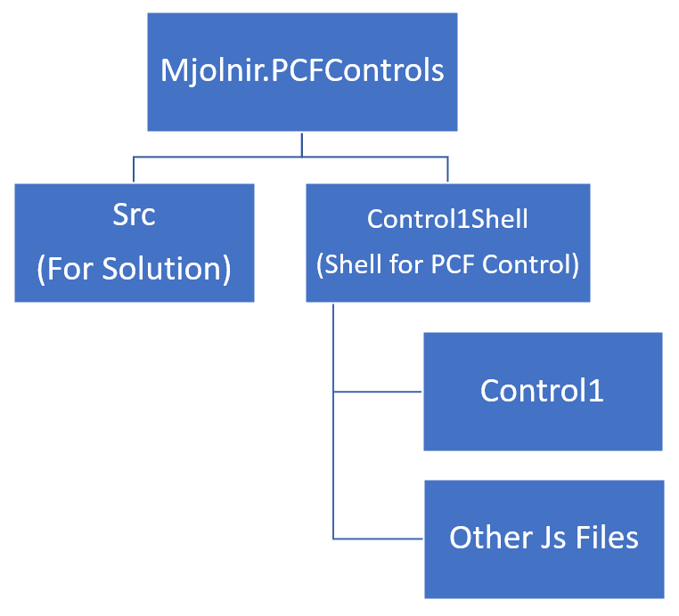

# How to Create a New Solution (cdsproj)

Use below command in PowerPlatform CLI

    pac solution init --publisher-name <> --publisher-prefix <> --outputDirectory <>

or short version

    pac solution init -pn <> -pp <> -o <>

It's important to note that, process will not create a shell directory, command will create below files directly into the specifed directory.

# How to Create a New PCF Component and Reference to Solution

Same as `Solution Init` command, PCF init does not create a shell directory, it is better to create directory manually then use below command to create PCF control.

    pac pcf init --namespace <> --name <> --template <>

or short version

    pac pcf init -ns <> -n <> -t <>

Control1Shell folder is created manually

Under Control1Shell, below files created by the command

Final Folder Structure

# How to Reference PCF Control in Solution

Navigate to same directory of `cdsproj` file and run below command

    pac solution add-reference --path <PCF root folder path>

Confirm the reference in `cdsproj`

