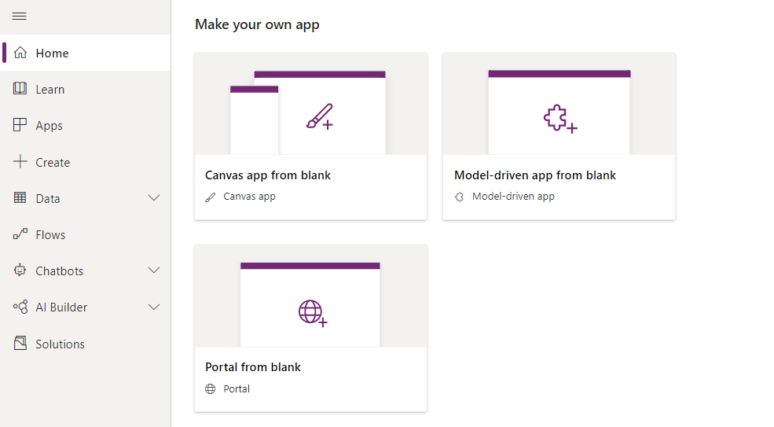
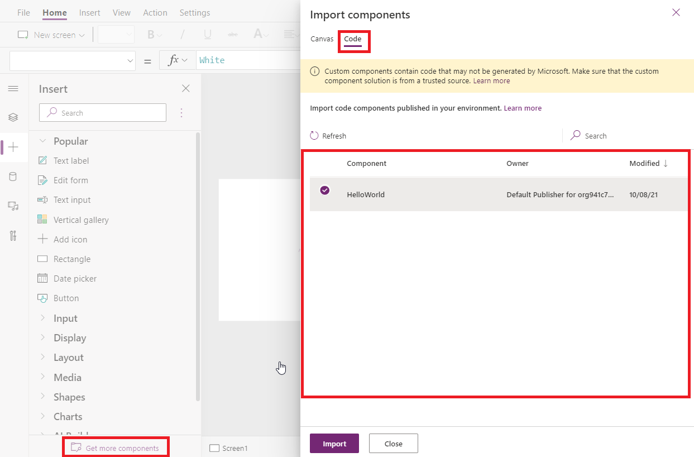
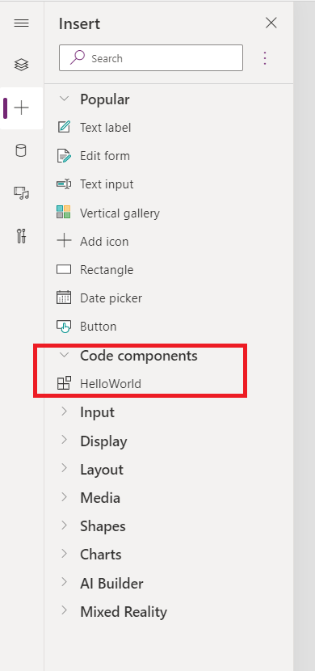
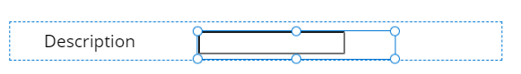

# How to use PCF Code Component in Canvas

## 1- Prerequisites

- Create PCF Code Component and push to Power Platform

## 2- Create Canvas App

- Use Blank or existing Canvas App
  
   
- Import PCF Code Component to Canvas App
  Click on "Get more components" to open Import Components panel
  Switch to "Code" tab, it will list down available PCF Code Components in the organization
  Then click "Import"
  
   
- Find recently imported Code Component in Toolbox
 
  
   
- Use in Canvas App
  
