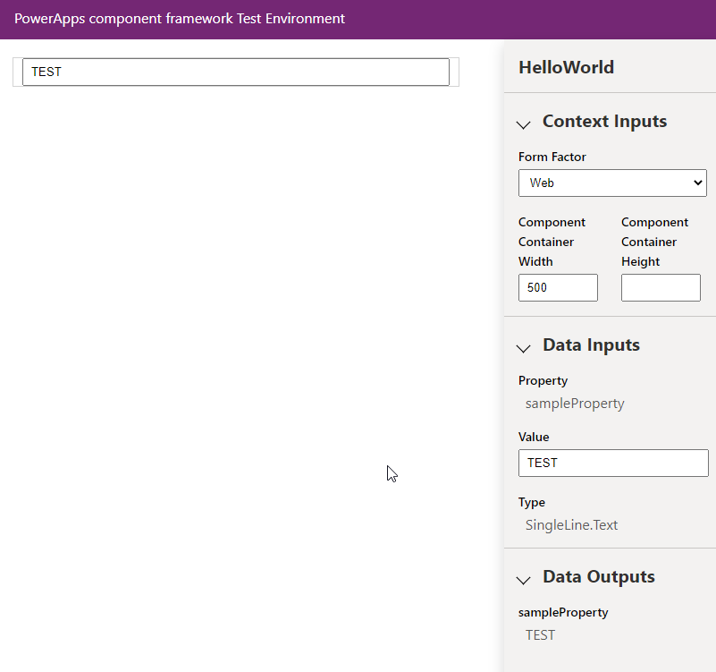
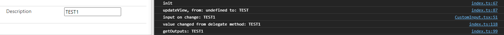
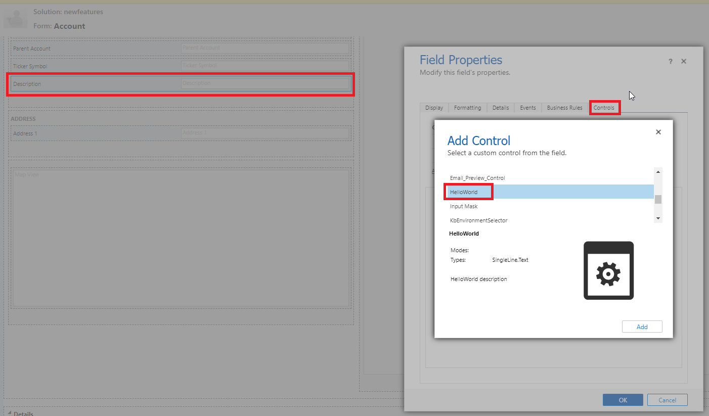

# Simple PCF Code Component By Using React

Simple code base for React based PCF Code Component

- Bound to SingleLine.Text field
- Changes reflects back to bound field
- On the entity form, it can mark form "Dirty" and triggers "Unsaved Changes"

 

# Preview

 

# Execution Log

# Important

- Test in real environment, Test Harness executes double/wrong updateView
- Switch to Classic Form Designer to be able to set Control
  
