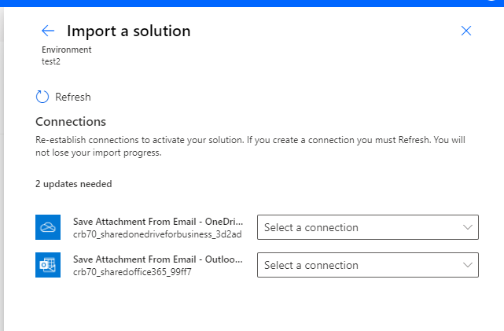
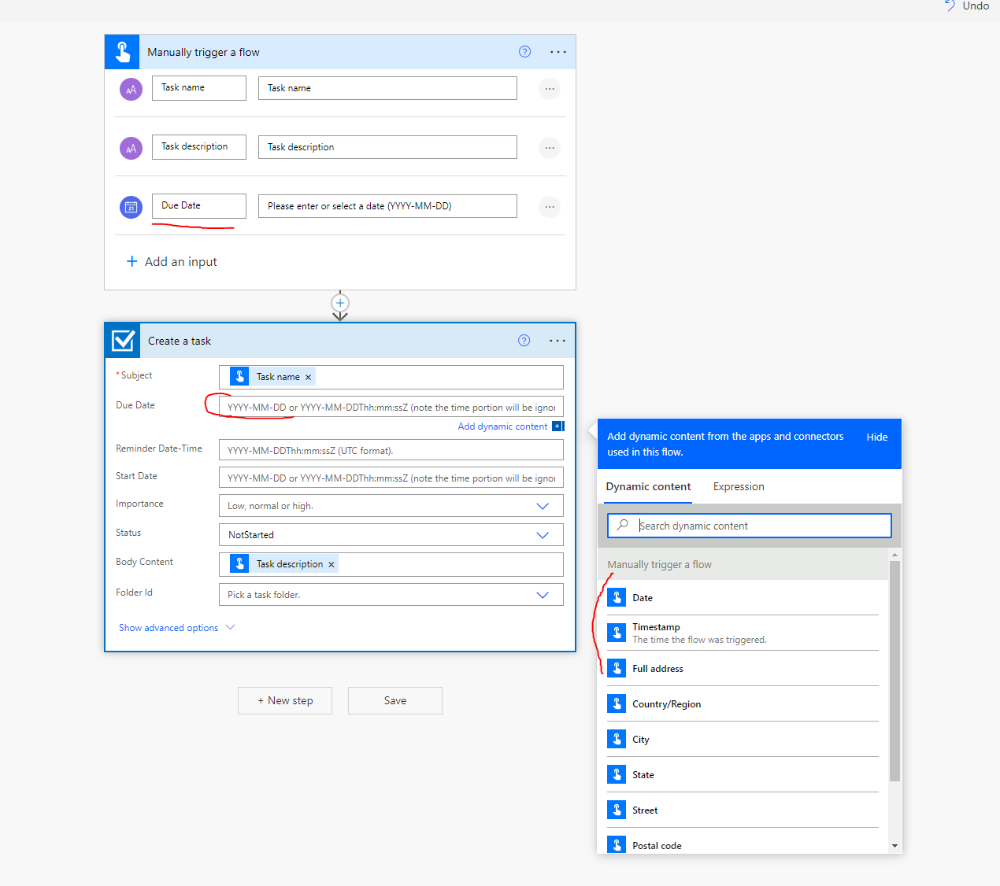
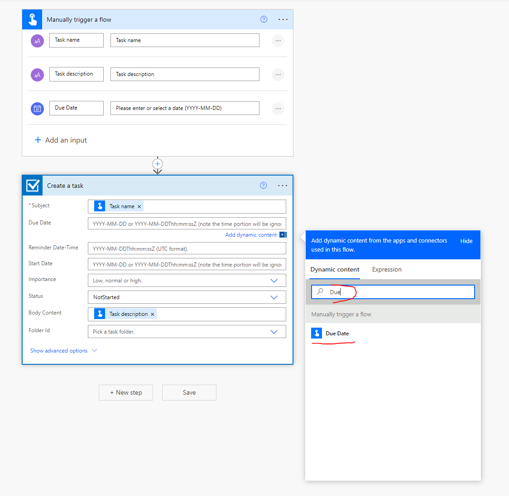
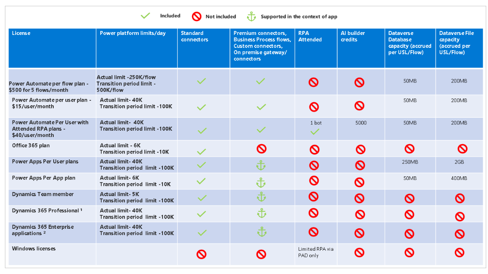
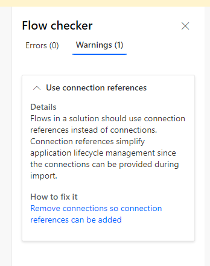
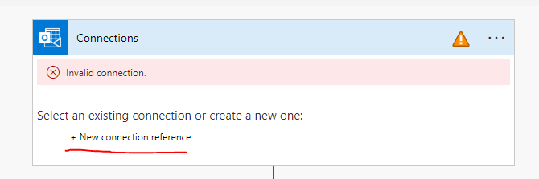
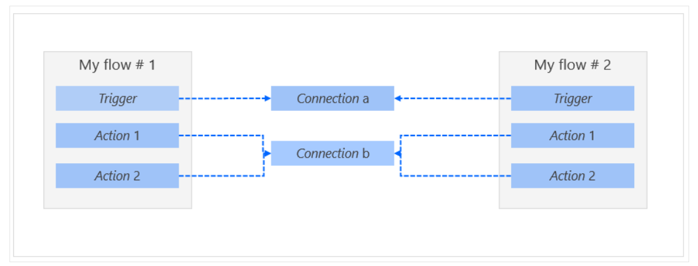
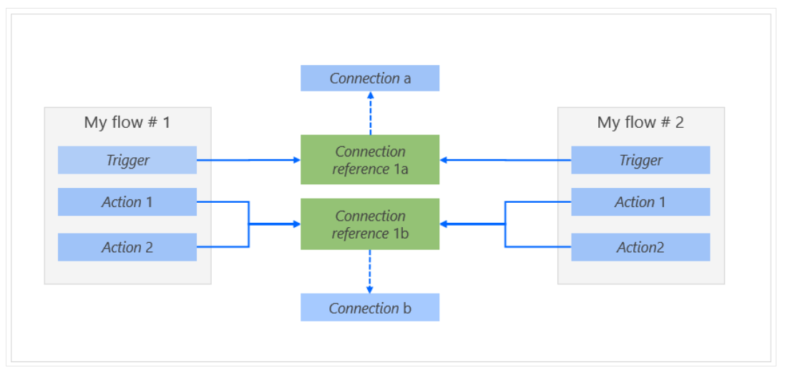

# Power Automate Notes

- Mobile for Power Automate helps creating, customizing flows. - Creating Flow in solution is not supported yet.

- Every flow has 2 parts, trigger and action.

- Premium Connectors might need 1 time sign in, such as MailChimp.

- Multiple people can own and manage a flow.

- Shared connections can be used only in the flow in which they were created.

- Owners can use services in a flow, but they can't change the credentials for a connection that another owner created.

- If you remove an owner whose credentials are used to access Power Automate services, be sure to update the credentials for those connections, so that the flow continues to work correctly.

- Shared flow owners can remove other owners but not the creator.

- If you stop using a connection in a flow, that connection appears in the Other connections list. It will remain there until an owner includes it in the flow again.

- Resubmitting a failed flow, creates a new instance, does not continue failed instance.

- When you import Flow to another organization, and if it uses External Reference, during import you need to provide new Connection References

  

- Limits - https://docs.microsoft.com/en-us/power-platform/admin/api-request-limits-allocations#licensed-user-request-limits

| Products                                                                                                                                                                     | Requests per paid license per 24 hours |
| ---------------------------------------------------------------------------------------------------------------------------------------------------------------------------- | -------------------------------------- |
| Paid licensed users for Power Platform (excludes Power Apps per App, Power Automate per flow, and Power Virtual Agents) and Dynamics 365 excluding Dynamics 365 Team Member1 | 40,000                                 |
| Power Apps pay-as-you-go plan, and paid licensed users for Power Apps per app, Microsoft 365 apps with Power Platform access, and Dynamics 365 Team Member2                  | 6,000                                  |
| Power Automate per flow plan3, Power Virtual Agents base offer, and Power Virtual Agents add-on pack4                                                                        | 250,000                                |
| Paid Power Apps Portals login                                                                                                                                                | 200                                    |

- Free Tier, if same flow is triggered last 15 min, then queues to next 15 minute
- Each account can have up to

  - 600 flows.
  - 50 custom connectors
  - 20 connections per application programming interface (API) and 100 connections total.

- You can install a gateway only in the default environment.

- Some external connectors, like Twitter, implement connection throttling to control the quality of service. Your flows might fail when throttling is in effect. If your flows are failing, review the details of the run that failed in the flow's run history.

- Button Flow Parameters
  | Parameter| Description|
  |------|-------|
  |City| The city where the device that's running the flow is located.|
  |Country/Region| The country/region where the device that's running the flow is located.|
  |Full address| The full address where the device that's running the flow is located.|
  |Latitude| The latitude where the device that's running the flow is located.|
  |Longitude| The longitude where the device that's running the flow is located.|
  |PostalCode| The postal code where the device that's running the flow is located.|
  |State |The state where the device that's running the flow is located.|
  |Street |The street where the device that's running the flow is located.|
  |Timestamp| The time in the area where the device that's running the flow is located.|
  |Date |The date in the area where the device that's running the flow is located.|
  |User name| The user name of the person who's signed in to the device that's running the flow.|
  |User email| The email address of the person who's signed into the device that's running the flow.|

- You can pass additional custom parameters to button flows.

- Dynamic Expressions may not directly show additional parameters requested as input. Search manually.
  
  

# Known Limits

- Canvas app instant flows must be created from an app already in a solution since adding this type of flow from outside solutions is blocked.
  - Workaround for this limitation: Remove the trigger, replace with another trigger like recurrence, save the flow, add it into a solution, and then change the trigger as needed.
- Canvas apps won't display in the classic solution explorer. Use the modern experience. There are no plans for them to be added to classic solution explorer.
- Flows created from solutions will not be displayed in the Shared with me list. They must be accessed through a solution.
- The Power Automate mobile app does not currently support flows created in a solution.
- The Flow action menu in Power Apps Mobile and Dynamics 365 for phones and tablets does not currently support flows created in a solution.
- Flows in solutions don't support delegated authentication. For example, access to a flow cannot be automatically granted based on having access to the SharePoint list the flow was created from.
- Custom connectors created outside solutions cannot be added to solutions at this time.
- Canvas apps shared with 'Everyone' that go through environment backup and environment restore operations aren't shared with 'Everyone' in the restored environment. Notice that, the canvas app can be shared with a security group and the app in the restored environment will be shared with that security group.
- Flows using connectors that are 'indexed' cannot be added into solutions. Indexing isn't supported for solution cloud flows yet. Indexing enables the quick retrieval of those flows to display in a menu or list. Indexed connectors include Power Automate instant (button) flows, Power Apps, Teams, SharePoint, Dynamics 365 Customer Voice, Microsoft Forms, legacy Dataverse connector, Dynamics 365, Excel Online, Microsoft Project, Azure IOT Central V2, and Project Online.
  - Workarounds for this limitation:
    - Edit the flow to remove the indexed connector triggers/actions, add it into a solution, and then change it back.
    - Create a new flow in a solution.
- Flows triggered from Microsoft 365 applications such as Excel cannot see/show cloud flows in solutions since they use indexing.

Resource: https://docs.microsoft.com/en-us/power-apps/maker/data-platform/solutions-overview#known-limitations

# Licensing

- Main Source: https://docs.microsoft.com/en-us/power-platform/admin/power-automate-licensing/types

- Licensing Guide https://go.microsoft.com/fwlink/?linkid=2085130

- Stand Alone or Seeded plans are available.
- Below are seeded licences and trigger or first action has to be related to below apps, otherwise flow is isolated and standalone license must be purchased.

  - Microsoft 365 (formerly Office 365).
  - Dynamics 365 Enterprise.
  - Dynamics 365 Professional.
  - Dynamics 365 Team Member.
  - Power Apps (Canvas and Model driven Apps)- Per App plans.
  - Power Apps per user.
  - Power Apps Plan 1 (grandfathered) - cannot be purchased anymore, renewals to Per User or Per Flow
  - Power Apps Plan 2 (grandfathered) - cannot be purchased anymore, renewals to Per User or Per Flow
  - Windows licenses.

- Limits are based on 24 Hours sliding window.
  
- Additional limit, in 5 minute only 100.000 requests can be made even though license has 250K for 24 hour sliding period.

- How to calculate Requests: https://docs.microsoft.com/en-us/power-platform/admin/power-automate-licensing/types#what-counts-as-power-platform-request
- Each trigger, action, loop and how many times looped, connector requests counts as individual requests and accumulated, check above link for email example.

# Best Practices

- https://docs.microsoft.com/en-us/power-platform/admin/power-automate-licensing/types#best-practices

- Flows that are moved into a solution should use Connection References instead of hardcodded credentials, otherwise it contains risk of using wrong credentials in the wrong environment
  
- New Connection Reference can be added in the Flow
  

- Without Connection Reference
  
- With Connection Reference
  
